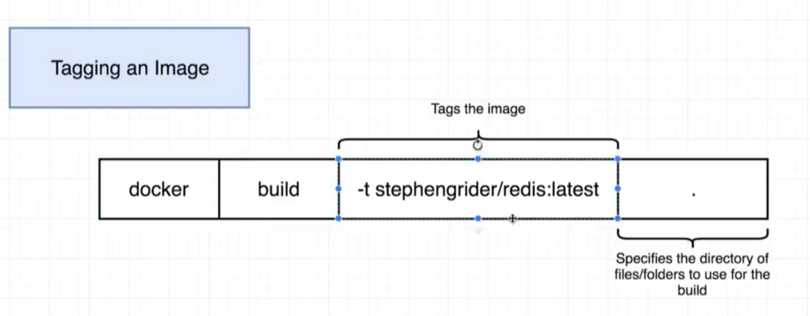
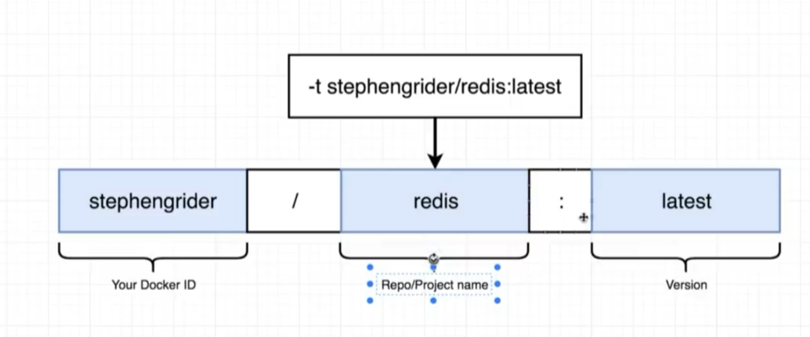
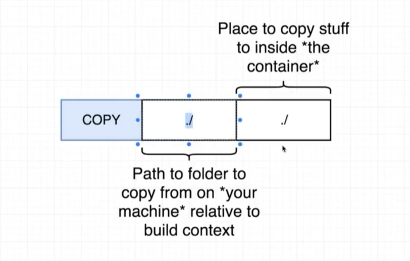
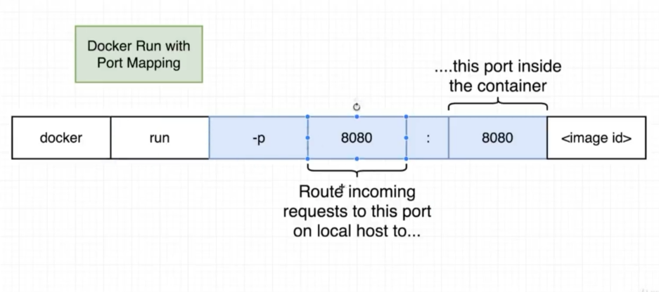

# Создание образов

[[toc]]

--- 

### Dockerfile
Dockerfile - файл инструкций для создание образа

```dockerfile
# Use an existiing docker image as a base
FROM alpine

# Download and install deps
RUN apk add --update redis

# Tell the image what to do when it starts as container
CMD ["redis-server"]
```

```sh
# . - dot is context (that means incapsulate current files into container)
docker build .

# getting <image-id> OR docker images
docker run <image-id>

```


### Именование образов



Составление правильного название 



```sh
# Whole option of naming
docker build -t nikeweke/my_image:latest .
# or 
docker build -t my_image .

# getting <image-id> OR docker images
docker run <image-id>
```

### Сохранение контейнеров в образы (commit)

```sh
# starting alpine and open shell there
docker run -it alpine sh

# installing there redis (changing file system)
> apk add --update redis

# Leaving this console and openning another
```

```sh
# finding container id
docker ps 

# "-c" - set default command of image
docker commit -c 'CMD ["redis-server"]' <container-id>
```


### Копирование файлов в контейнер (Dockerfile - COPY)




### Открытие порта для контейнера (port mapping)




### Ускорение построения образа (cache boost)

```dockerfile
# Use an existiing docker image as a base
FROM node:alpine

# Make directory if not exist and set pwd there for COPY, ADD, etc.
WORKDIR /usr/app

# ====================================> Why we run first "copy package.json" & "npm install"?
# ====================================> Cuz when we change only our source file "app.js" it will rebuild all steps after it and install deps
# Download and install deps 
COPY ./package*.json ./
RUN npm install

# Copying project
# First path - is path to folder to copy from on relative to build context 
# (docker run build .) - dot is context
COPY ./ ./


# Tell the image what to do when it starts as container
CMD ["node", "app"]

```

### Построение образа с указанием определнного dockerfile
```sh
docker build -f Dockerfile.dev .
```

в `docker-compose.yml` вот так
```yml
version: '3'
services: 
  web:
    build: 
      context: .
      dockerfile: Dockerfile.dev
```