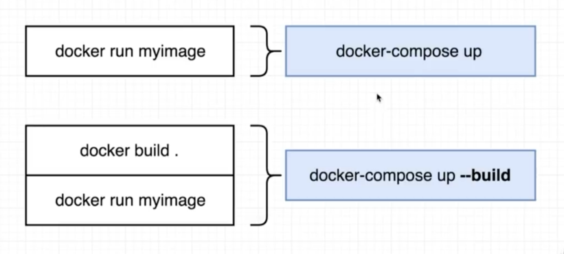
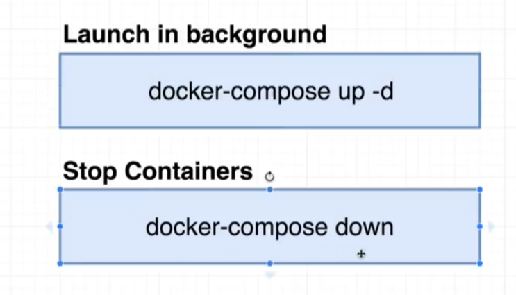
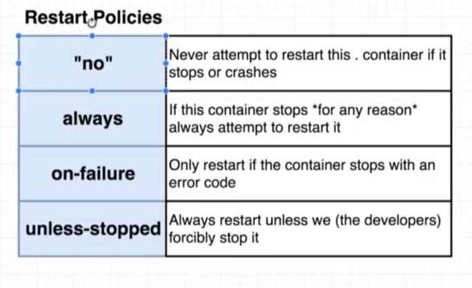

# Docker compose

[[toc]]

---


### docker-compose.yml
```yml
version: '3'

# when starting containers - docker automatically
# makes network for specified services(containers)
# where they can see each other

# service same as container here
services: 
  redis-server:
    image: 'redis'
  
  node-app: 
    build: ./node-app
    ports: 
      - '4001:8081'
```

### Dockers commands



<br />




### Автоматическая перегрузка контейнеров (restarts)

Коды при которых перегрузиться контейнер
* 0 - ОК, это нормальный код окончания процесса (always)
* 1, ... - от 1 и дальше, это уже ненормальное окончание процесса (on-failure)



**'no'** - должны быть в кавычках, потому что в `yml` это как **false**

```yml
version: '3'

# when starting containers - docker automatically
# makes network for specified services(containers)
# where they can connect each other

# service same as container here
services: 
  redis-server:
    image: 'redis'
  
  node-app: 
    build: ./node-app
    ports: 
      - '8000:8000'
    depends_on: 
      - redis-server
    restart: always
```