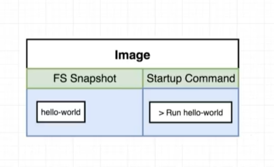
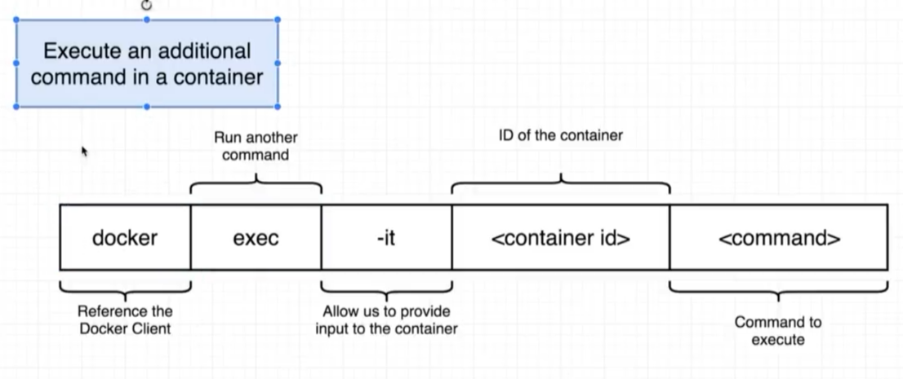

# Управление контейнерами

[[toc]]

--- 


### Из чего состоит образ
* FS Snapshot - файловая система
* Startup command - комманда с которой запускаеться образ



### Перегрузка стандартной комманды образа
`docker run <image-name> [command]`
`[command]` - перегрузит комманду с которой запускаеться контейнер

```
docker run busybox echo hi there
docker run busybox ls
```


### Список контейнеров
* `docker ps`
* `docker ps -a`

```sh
# start checking latency from container of google
docker run busybox ping google.com

# show containers that works
docker ps
```


### Разница между `run`, `create` & `start`
* `docker run` = `docker create` + `docker start`
* `docker create` - переносит из образа FS Snapshot в контейнер 
* `docker start` - запускает комманду в контейнере и запускает контейнер

```sh
# moving FS Snaphot to a container (preparing container) 
docker create hello-world
c3065b4577668eefc26b8d43fd8a56a4588a5f1770bab7bc14ff7b89ea7ad9df

# running container with command
# "-a" - output logs from container in my console
docker start -a c3065b4577668eefc26b8d43fd8a56a4588a5f1770bab7bc14ff7b89ea7ad9df
```


### Перезапуск остановленного контейнера
```sh
docker ps -a

docker start <container-id>
docker start -a <container-id>

# you cannot start stopped container with new command
# docker start -a <container-id> echo bye there
```


### Очистка docker
Удаление всего что связано с docker
```
docker system prune 
docker system prune -a
```


### Логи контейнера
```sh
docker create busybox echo hi there
# it will give you - <container-id>

docker start <container-id>

docker logs <container-id>
```


### Остановка контейнера (stop, kill)
```sh
docker create busybox ping google.com
# <container-id>

docker start <container-id>

# gives container SIGTERM inside container
docker stop <container-id> 

# gives container SIGKILL inside container 
docker kill <container-id>
```


### Мульти-комманды для контейнера (exec, "-it")
`docker exec` - выполнение дополнительной комманды в контейнере




```sh
docker run redis
# gives <container-id> OR docker ps

# "-it" - gives an access to a redis-cli inside of container
docker exec -it <container-id> redis-cli
# OR "-i -t"
# "-i" - means that what you type in local console must get into container
# "-t" - format text (u may see no identifying cursor if this flag absent)

127.0.0.1:6379>set myvalue 5
OK
127.0.0.1:6379>get myvalue
"5"
```


### Подключение к контейнеру (exec, "-it", sh)
**sh** - command processor unix (like powershell for windows)

```sh
docker ps 

# getting into container itself
docker exec -it <container-id> sh
# ls
# cd /

# FOR EXIT from container CTRL+D or type "exit"
```


### Запуск контейнера с Shell (run, "-it", sh)
```sh
docker run -it busybox sh
# ls
# echo hi there
```